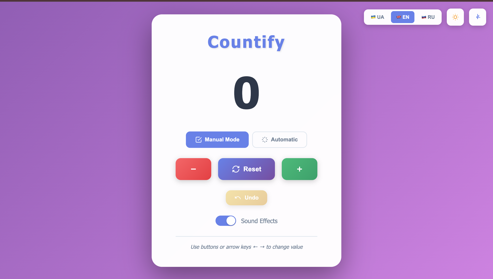
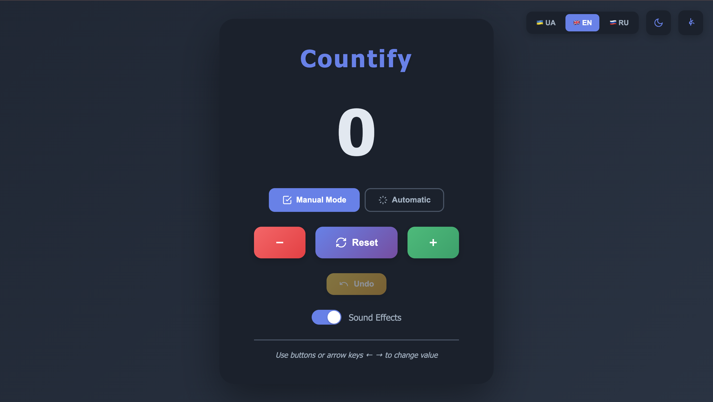
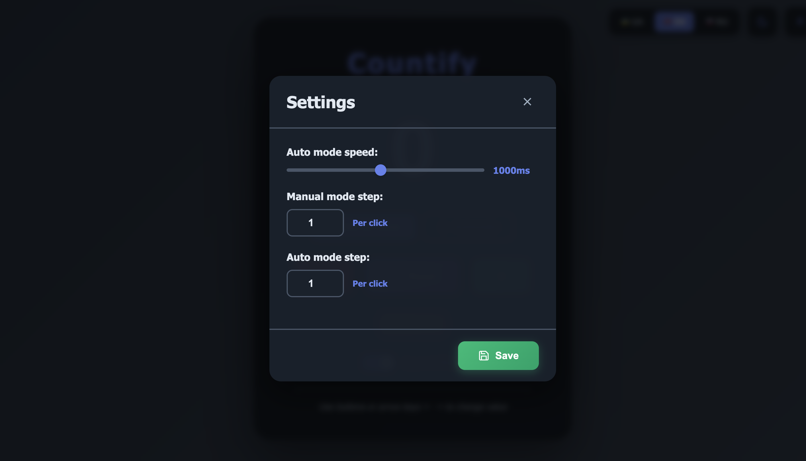

# 🎯 Countify — Animated Counter

Beautiful counter with smooth number animations, sound effects, and flexible settings. Simple yet elegant counting tool with manual and automatic modes support.


---

## ✨ Key Features

### 🎨 Interface
- 🌈 Animated gradient background
- 🌗 Light and dark themes
- 📱 Fully responsive design
- 💫 Smooth CSS animations and transitions
- 🎭 Ripple effects on buttons

### ⚙️ Functionality
- ➕ Increment/decrement with customizable step
- 🔄 Reset button to clear value
- ↩️ Undo — revert last action (up to 50 actions in history)
- 🤖 Automatic mode with adjustable speed
- ⚡ Manual mode with custom step

### 🎵 Sounds and Effects
- 🔊 Sound effects via Web Audio API
- 🎚️ Option to disable sounds
- 🎨 Color indication of actions (green +, red -)

### 🌍 Localization
- 🇺🇦 Ukrainian
- 🇬🇧 English
- 🇷🇺 Russian

### ⌨️ Controls
- **Arrow keys ← →** — change value
- **R** — reset
- **Ctrl+Z** — undo
- 🖱️ Click on buttons

### 💾 Storage
- All settings saved in LocalStorage
- Action history for Undo
- Current counter value
- Selected theme, language, mode

---

## 🚀 Quick Start

### Running the Project

```bash
# Clone repository
git clone https://github.com/frelancer-web-dev/countify.git

# Navigate to folder
cd countify

# Open index.html in browser
# Or use Live Server
```

### Project Structure

```
countify/
│
├── index.html          # Main HTML page
├── README.md           # Documentation
│
└── src/
    ├── main.css       # All styles and animations
    ├── main.js        # App logic
    │
    └── images/
        ├── favicon.png    # Site icon
        ├── screen1.png    # Light theme
        ├── screen2.png    # Dark theme
        └── screen3.png    # Settings
```

---

## 🛠️ Technologies

- **HTML5** — structure
- **CSS3** — styling, animations, gradients
- **JavaScript (ES6+)** — logic, OOP
- **Web Audio API** — sound effects
- **LocalStorage API** — data persistence

---

## ⚙️ Settings

Open settings modal (gear icon) to configure:

- 🕐 **Auto mode speed** — from 100 to 2000ms
- 🔢 **Manual mode step** — how much to add/subtract per click
- 🔢 **Auto mode step** — step for auto-increment

All settings are saved automatically!

---

## 🎯 Operation Modes

### Manual Mode
- Control via buttons or keyboard
- Customizable step (1, 5, 10, 100...)
- Instant response

### Automatic Mode
- Automatic value increment
- Adjustable speed
- Start/Stop button
- Custom increment step

---

## 📸 Screenshots

### Light Theme


### Dark Theme


### Settings


---

## 🎨 Design Features

- **Gradient background** with animation
- **Glassmorphism** effect for containers
- **Smooth transitions** between themes
- **Adaptive typography**
- **Micro-animations** on hover
- **Color palette**:
  - Accent: `#667eea` (purple)
  - Success: `#48bb78` (green)
  - Error: `#f56565` (red)
  - Warning: `#ecc94b` (yellow)

---

## 🐛 Known Limitations

- Sounds work only after first page interaction (browser restriction)
- LocalStorage limited to ~5MB
- Undo history saves maximum 50 actions

---

## 🤝 Contributing

All improvements are welcome! Create Pull Request or Issue.

### How to contribute:

1. Fork the project
2. Create branch (`git checkout -b feature/AmazingFeature`)
3. Commit changes (`git commit -m 'Add AmazingFeature'`)
4. Push to branch (`git push origin feature/AmazingFeature`)
5. Open Pull Request

---

## 📄 License

**MIT License**

Copyright (c) 2025 Mykola

Permission is hereby granted to use, modify, and distribute this software free of charge, provided this copyright notice is preserved.

---

## 👤 Author

**Mykola** — Frontend Developer & Designer

- 🐙 GitHub: [@frelancer-web-dev](https://github.com/frelancer-web-dev)
- 💼 Upwork: [Profile](https://www.upwork.com/freelancers/~01dec1110f4bac0e7d)
- 💬 Telegram: [@privatefanat_dep](https://t.me/privatefanat_dep)

---

## 🤝 AI Co-Author

Developed with support of **Jarvis AI Coder** — AI assistant for web development

---

## 📞 Support

If you have questions or suggestions:

- Create an [Issue](https://github.com/frelancer-web-dev/countify/issues)
- Message me on [Telegram](https://t.me/privatefanat_dep)

---

⭐ If this project was helpful, give it a star on GitHub!
